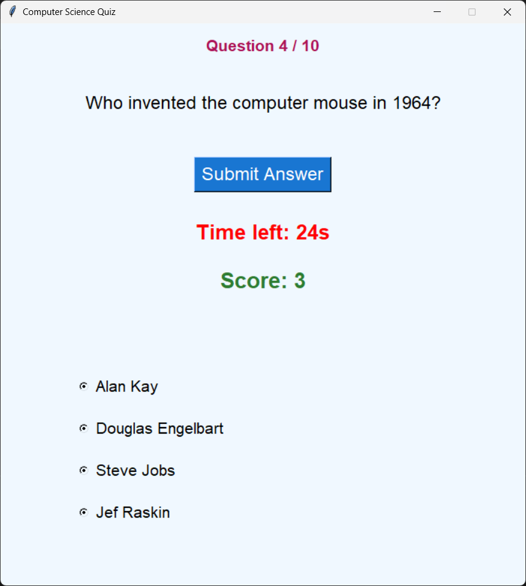
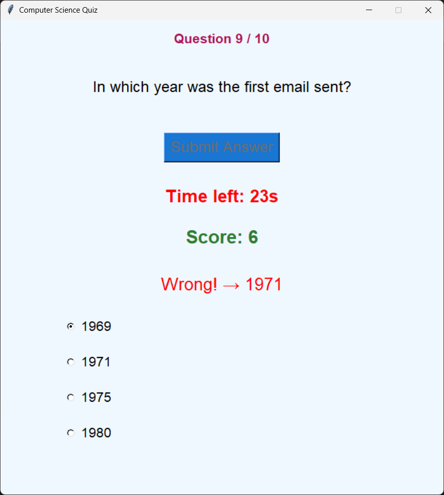
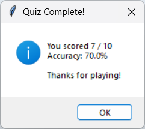

# Multiple-Choice Quiz App

A fun and clean desktop quiz I built from scratch using **Python + Tkinter**

### What it does
- 60 hand-crafted questions about Computer History & Fundamentals  
- Pick 10, 20, 30, 40, 50 or all 60 questions  
- 30-second timer per question (feel the pressure!)  
- Instant "Correct!" or "Wrong!" feedback with colors  
- Final score + percentage at the end  
- Your high scores are automatically saved to a file so you can beat your record later

### Screenshots 

  
  
  


### How to run it 
```bash
git clone https://github.com/pukardahalx/multiple-choice-quiz-app.git
cd multiple-choice-quiz-app
python quiz_app.py
